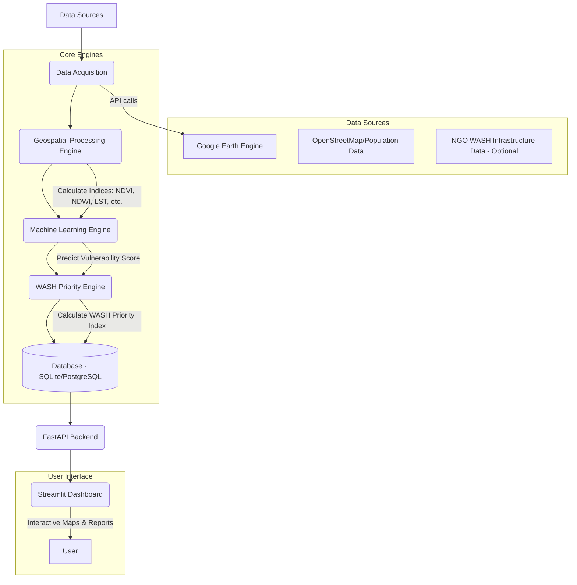
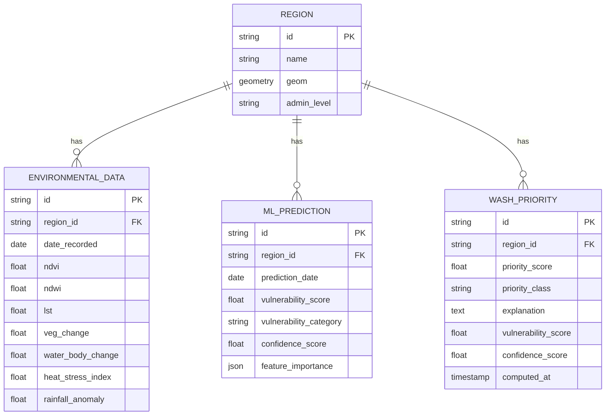

# Deliverable 1 – Project Understanding & System Architecture

## AI-Enabled Geospatial Decision Support System for Climate-Resilient WASH Planning

---

## 1. Project Overview

### 1.1 Problem Statement
Climate change exacerbates the vulnerability of communities by affecting water availability, increasing the frequency of extreme weather events, and driving environmental degradation. Water, Sanitation, and Hygiene (WASH) infrastructure planning often lacks actionable, high-resolution geospatial insights to prioritize interventions effectively. Planners need a data-driven way to assess environmental risks and climate vulnerability to allocate resources where they are most needed.

### 1.2 Solution
This project aims to build an AI-Enabled Geospatial Decision Support System. Rather than attempting to measure existing WASH infrastructure levels directly from space, the system identifies key environmental and climate risks that influence WASH planning. By analyzing satellite imagery (Google Earth Engine) and applying machine learning or statistical modeling, the system assesses climate vulnerability and generates a **WASH Intervention Priority Index**. This index helps NGOs and policymakers prioritize areas for WASH interventions based on environmental stress and vulnerability.

### 1.3 What This System Does NOT Do
*   **Measure Existing WASH Levels:** WASH access heavily depends on socioeconomic factors, household-level infrastructure, and local governance, which cannot be reliably observed from satellite imagery alone.
*   **Replace Ground Truth:** The system highlights vulnerable regions to *guide* ground surveys and intervention planning; it does not replace the need for field verification.
*   **Design Engineering Solutions:** It identifies *where* interventions are needed most, not *how* to engineer specific water or sanitation facilities.

### 1.4 Target Users
*   NGO Project Managers & Field Coordinators
*   Government Planners & Policymakers
*   WASH Researchers & Climate Analysts

---

## 2. System Architecture

### 2.1 High-Level Architecture Diagram



### 2.2 Architecture Pattern
The system follows a modular, multi-tier architecture:
1.  **Data Layer:** External APIs (GEE, OSM) and the internal relational database.
2.  **Processing Layer:** Scripts for fetching data, calculating environmental indices, and engineering features.
3.  **Analytics & ML Layer:** Machine learning models (Supervised or Unsupervised) to generate vulnerability scores.
4.  **Priority Engine Layer:** A dedicated module that ingests vulnerability assessments and environmental indicators to compute the WASH Intervention Priority Index and generate human-readable explanations.
5.  **Service Layer:** FastAPI for serving predictions, priority scores, and data to the frontend.
6.  **Presentation Layer:** Streamlit for interactive maps and dashboards.

### 2.3 Design Principles
*   **Modularity:** Each engine (Processing, ML, Priority) operates independently.
*   **Scalability:** Designed to handle increasing data volumes and geographic scope.
*   **Interpretability:** Priority scores must be accompanied by explanations to build trust.
*   **Resilience:** Fallbacks for ML (e.g., K-Means or weighted risk models if labeled data is scarce).

---

## 3. Folder Structure

```text
AI-GEO-NGO/
├── data/                      # Local data storage
│   ├── raw/
│   ├── processed/
│   └── models/
├── docs/                      # Documentation
│   └── architecture.md
├── notebooks/                 # Jupyter notebooks for EDA and model training
├── src/                       # Source code
│   ├── acquisition/           # Module 1
│   │   ├── __init__.py
│   │   ├── gee_client.py
│   │   └── osm_client.py
│   ├── processing/            # Module 2
│   │   ├── __init__.py
│   │   ├── vegetation.py
│   │   ├── water.py
│   │   ├── temperature.py
│   │   ├── water_change.py
│   │   ├── heat_stress.py
│   │   └── rainfall_anomaly.py
│   ├── ml/                    # Module 4
│   │   ├── __init__.py
│   │   ├── train.py
│   │   ├── predict.py
│   │   └── clustering.py
│   ├── priority/              # Module 5 (NEW)
│   │   ├── __init__.py
│   │   ├── engine.py          # Priority calculation logic
│   │   ├── explainer.py       # Explanation generation
│   │   └── scoring.py         # Scoring functions
│   ├── api/                   # Module 6
│   │   ├── __init__.py
│   │   ├── main.py
│   │   ├── routes.py
│   │   └── schemas.py
│   ├── dashboard/             # Module 7
│   │   ├── __init__.py
│   │   ├── app.py
│   │   ├── pages/
│   │   │   ├── 1_overview.py
│   │   │   ├── 2_vulnerability_map.py
│   │   │   ├── 3_vegetation_change.py
│   │   │   ├── 4_water_body_change.py
│   │   │   ├── 5_urban_expansion.py
│   │   │   ├── 6_wash_priority.py
│   │   │   └── 7_reports.py
│   │   └── components/
│   └── utils/
│       ├── __init__.py
│       ├── config.py
│       └── logger.py
├── tests/
├── .env.example
├── .gitignore
├── requirements.txt
├── Dockerfile
└── README.md
```

---

## 4. Technology Stack

*   **Language:** Python 3.10+
*   **Geospatial Data Processing:** Google Earth Engine Python API (`ee`), `geopandas`, `rasterio`, `shapely`
*   **Machine Learning / Analytics:** `scikit-learn` (Random Forest, K-Means), `xgboost` (Optional), `pandas`, `numpy`
*   **Backend & API:** `FastAPI`, `uvicorn`, `SQLAlchemy` (ORM)
*   **Database:** `SQLite` (Development), `PostgreSQL` + `PostGIS` (Production)
*   **Frontend UI:** `Streamlit`, `folium` / `streamlit-folium`, `plotly`
*   **Reporting:** `fpdf2` (PDF Generation)
*   **Deployment & DevOps:** Docker, GitHub Actions, Render/Railway/GCP

---

## 5. Data Flow Diagram

| Stage | Action | Component | Output |
| :--- | :--- | :--- | :--- |
| **1. Ingestion** | Fetch imagery, climate, & OSM data | `src/acquisition/` | Raw GeoTIFFs / GeoJSON |
| **2. Processing** | Compute indices (NDVI, NDWI, LST, etc.) & anomalies | `src/processing/` | Engineered Features (DataFrame/Tensors) |
| **3. Modeling** | Predict vulnerability or cluster regions | `src/ml/` | Vulnerability Score, Confidence Score |
| **4. Prioritization** | Calculate WASH Priority Index & generate explanations | `src/priority/` | Priority Score (0-100), Category, Explanation |
| **5. Storage** | Save results to database | Database layer | Stored Records |
| **6. Serving** | Serve data via REST endpoints | `src/api/` | JSON API Responses |
| **7. Visualization**| Render maps, charts, and reports | `src/dashboard/` | Interactive UI |

---

## 6. Database Schema

### Entity-Relationship Diagram



---

## 7. API Architecture

The FastAPI backend will expose the following key endpoints:

*   **`GET /regions`**: List all regions.
*   **`GET /data/{region_id}`**: Get environmental indices for a region.
*   **`GET /predict/{region_id}`**: Trigger or fetch ML vulnerability prediction.
*   **`GET /priority`**: Get priority list for all regions.
*   **`GET /priority/{region_id}`**: Get specific WASH priority details.
*   **`POST /priority/compute`**: Trigger batch priority computation.
*   **`GET /priority/summary`**: Get aggregated statistics on priority classes.

**Example Response for `/priority/{region_id}`:**
```json
{
  "region_id": "REG-104",
  "priority_score": 82.5,
  "priority_class": "High Priority",
  "vulnerability_score": 0.88,
  "explanation": "High priority assigned due to severe water body depletion (-15% over 5 years) coupled with high heat stress index and rapid urban expansion.",
  "top_contributing_factors": {
    "water_body_change": 0.45,
    "heat_stress_index": 0.30,
    "urban_growth": 0.15,
    "vegetation_change": 0.10
  },
  "computed_at": "2026-07-18T12:00:00Z"
}
```

---

## 8. Module Breakdown

### Module 1: Data Acquisition (`src/acquisition`)
*   Interfaces with Google Earth Engine to retrieve Sentinel-2, Landsat, and climate datasets.
*   Fetches OpenStreetMap data for infrastructure/settlement proxies.

### Module 2: Geospatial Processing (`src/processing`)
Computes essential indices and derived indicators:
*   **Vegetation & Water:** NDVI, NDWI
*   **Temperature:** LST
*   **New Derived Indicators:**
    *   `vegetation_change.py`: Long-term NDVI trends.
    *   `water_change.py`: Changes in surface water extent (NDWI variance).
    *   `heat_stress.py`: Identifies periods of extreme LST relative to historical baselines.
    *   `rainfall_anomaly.py`: Deviations from average precipitation patterns.
    *   `urban_growth`: Expansion of built-up areas using classification models or nightlights.

### Module 3: Storage & Database Operations
*   Manages data ingestion into SQLite/PostgreSQL.

### Module 4: Machine Learning Engine (`src/ml`)
Generates the core vulnerability assessment.
*   **Supervised Path (If labeled data available):** Random Forest (primary), XGBoost (optional) to predict vulnerability scores based on target labels.
*   **Unsupervised Path (If labeled data unavailable):** K-Means Clustering to group regions into High, Medium, and Low vulnerability clusters, or a Weighted Environmental Risk Model.
*   **Outputs:** Climate Vulnerability Score, Vulnerability Category (Low/Medium/High), Confidence Score (if applicable), and Feature Importance.

### Module 5: WASH Intervention Priority Engine (`src/priority`) [NEW]
*   **`engine.py`**: Ingests vulnerability assessments and environmental indicators to calculate the WASH Intervention Priority Index (0-100).
    *   0-40: Low Priority
    *   41-70: Medium Priority
    *   71-100: High Priority
*   **`scoring.py`**: Contains the weighting logic for combining factors (e.g., weighting water body change higher in drought-prone areas).
*   **`explainer.py`**: Generates human-readable explanations of *why* an area received its priority score based on the highest contributing factors.

### Module 6: API Backend (`src/api`)
*   FastAPI application serving data and triggering computations.

### Module 7: Interactive Dashboard (`src/dashboard`)
*   Streamlit app with ~11 pages including: Overview, Vulnerability Map, Vegetation Change, Water Body Change, Urban Expansion, WASH Intervention Priority Map, and Reports.

---

## 9. Development Roadmap

*   **Phase 1: Foundation (Weeks 1-2)**
    *   Project setup, GEE authentication, database schema design, and basic API scaffolding.
*   **Phase 2: Data & Processing Pipeline (Weeks 3-5)**
    *   Implement GEE extraction and index calculation (NDVI, NDWI, LST).
    *   Develop derived indicators (Water Change, Heat Stress, Rainfall Anomaly).
*   **Phase 3: ML & Priority Engine Development (Weeks 6-8)**
    *   Implement clustering (K-Means) and risk modeling.
    *   Develop the WASH Intervention Priority Engine, scoring logic, and explainer.
*   **Phase 4: Dashboard & Integration (Weeks 9-10)**
    *   Connect API to the database.
    *   Build all Streamlit dashboard pages, including new map views for priority and changes.
*   **Phase 5: Deployment Strategy & Refinement (Weeks 11-12)**
    *   Containerization, CI/CD setup, testing, and cloud deployment.

---

## 10. Labeling & Modeling Strategy

Since ground-truth data on WASH vulnerability is often scarce, the system employs a flexible approach:
1.  **K-Means Clustering (Primary Fallback):** If labeled data is unavailable, the system groups regions based on their environmental features into distinct risk categories.
2.  **Weighted Environmental Risk Model:** An alternative unsupervised approach where experts assign weights to indicators (e.g., water depletion = 40%, heat stress = 30%) to compute a vulnerability score.
3.  **Composite Scoring:** Combining multiple indices into a single representative score.
4.  **Expert Annotation (If possible):** NGOs provide partial labels for a subset of regions to train supervised models (Random Forest).

---

## 11. Key Design Decisions

*   **Reframing the AI Goal:** Decided against directly measuring WASH infrastructure from space, recognizing the limitations of satellite imagery. Instead, the focus shifted to identifying environmental *drivers* of WASH vulnerability.
*   **Supervised vs. Unsupervised Approach:** Designed the ML pipeline to be dual-track, defaulting to K-Means/Weighted Models to ensure the system is operational even without extensive ground-truth data.
*   **WASH Priority Index Design:** Decided to separate the "Vulnerability Score" (purely analytical) from the "Priority Index" (action-oriented) to allow for policy-based weighting and human-readable explanations.

---

## 12. Risk & Mitigation

| Risk | Impact | Mitigation Strategy |
| :--- | :--- | :--- |
| **GEE Quota Limits** | High | Implement local caching, spatial subsetting, and optimize GEE queries to minimize payload size. |
| **Lack of Labeled Data** | High | Rely on robust unsupervised methods (K-Means) and composite environmental risk indicators. |
| **Priority Index Calibration** | Medium | Work closely with NGO partners to iteratively adjust the weights in the `scoring.py` module to reflect reality on the ground. |
| **Dashboard Performance** | Medium | Use simplified geometries for rendering large areas in Folium/Streamlit and pre-calculate scores. |

---

## 13. Deployment Strategy

The system is designed for a phased rollout to balance cost and scale:

1.  **Development:**
    *   Local machine using SQLite and standard Python environments.
2.  **Staging (Proof of Concept):**
    *   Backend/API: Deployed on free-tier platforms like Render or Railway.
    *   Dashboard: Streamlit Community Cloud.
    *   Database: Render PostgreSQL (free tier) or local SQLite attached to the container.
3.  **Production (Future Scale):**
    *   Cloud Provider: Google Cloud Platform (GCP).
    *   Compute: Google Cloud Run (for FastAPI) and App Engine (for Streamlit).
    *   Database: Cloud SQL for PostgreSQL + PostGIS.
4.  **CI/CD Pipeline:**
    *   GitHub Actions configured to run tests and automatically deploy to staging/production upon merges to the main branch.
5.  **Containerization:**
    *   Dockerfiles provided for both the FastAPI backend and the Streamlit frontend to ensure consistent environments across all deployment stages.
