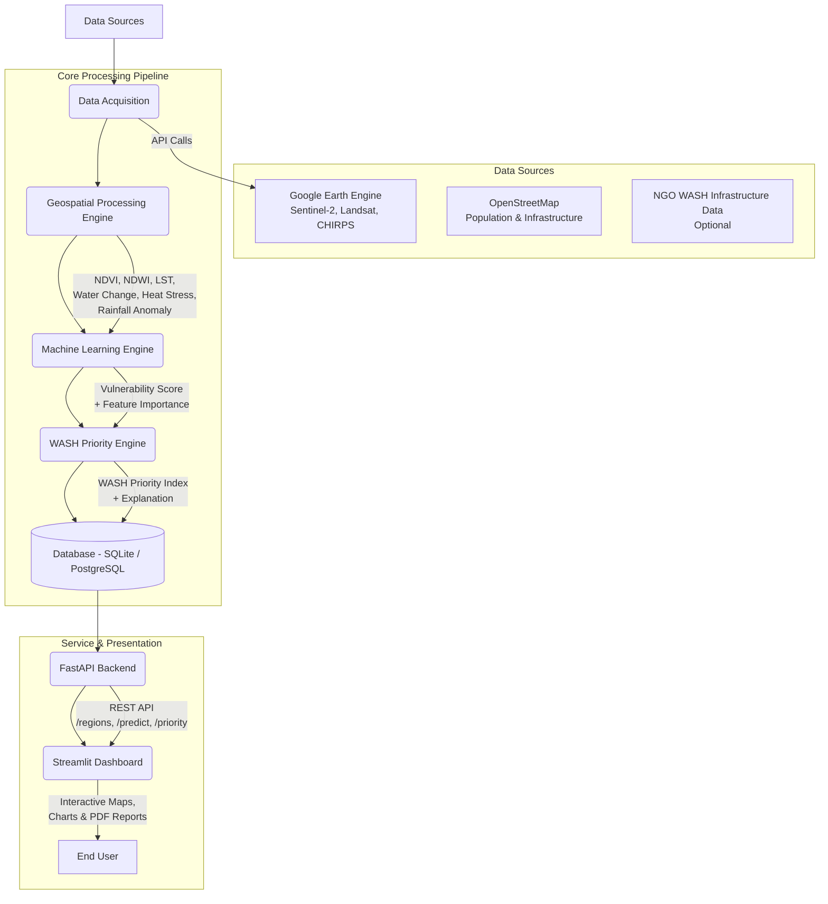
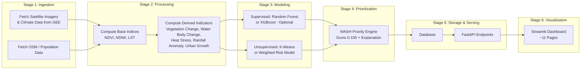
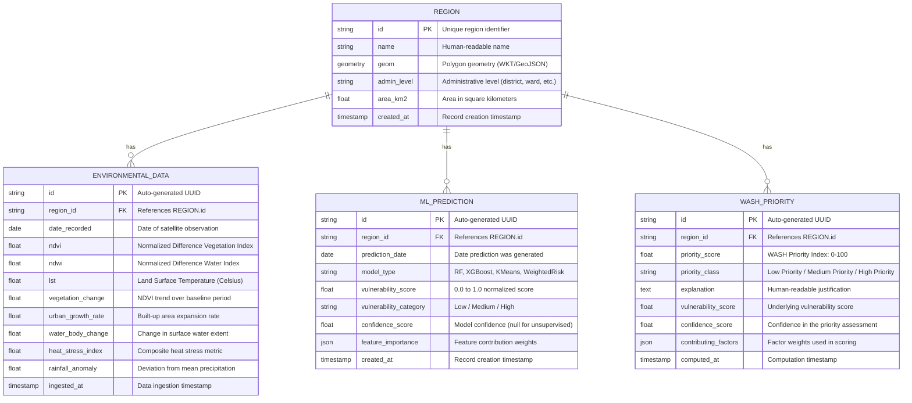
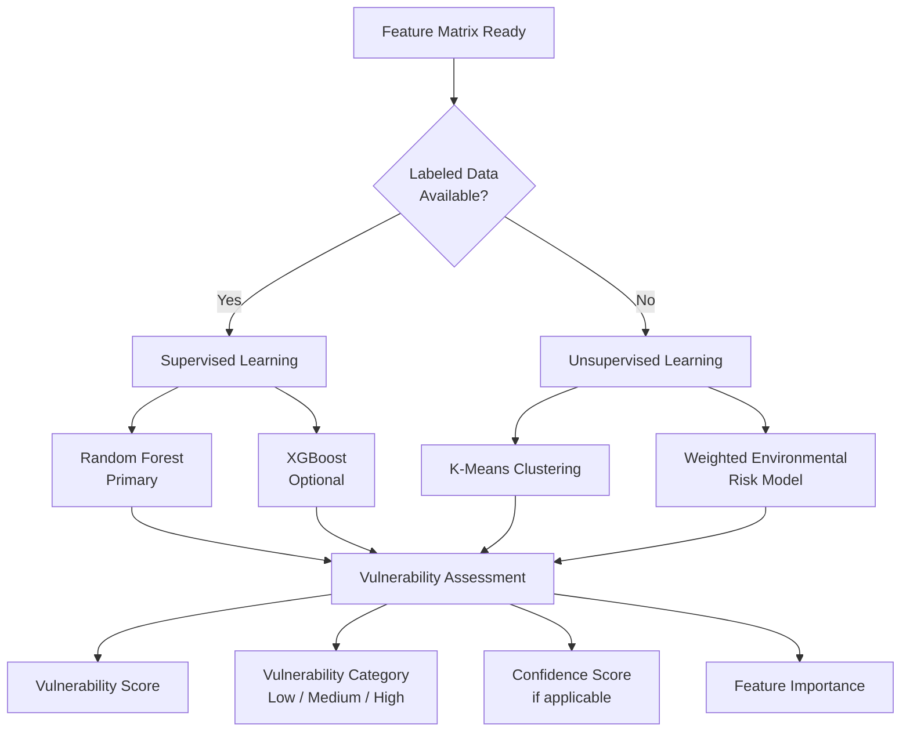
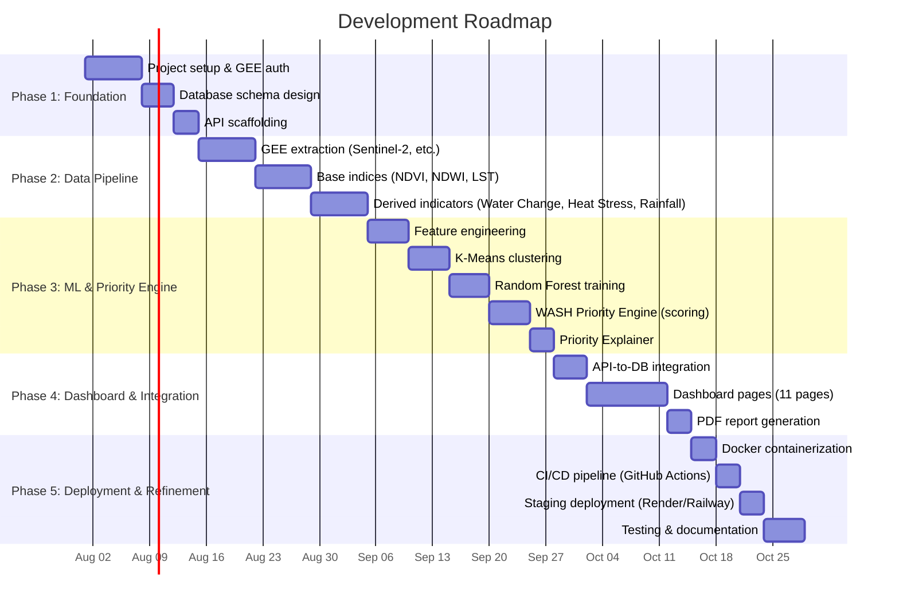
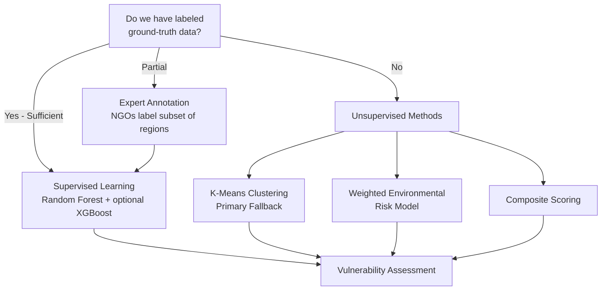
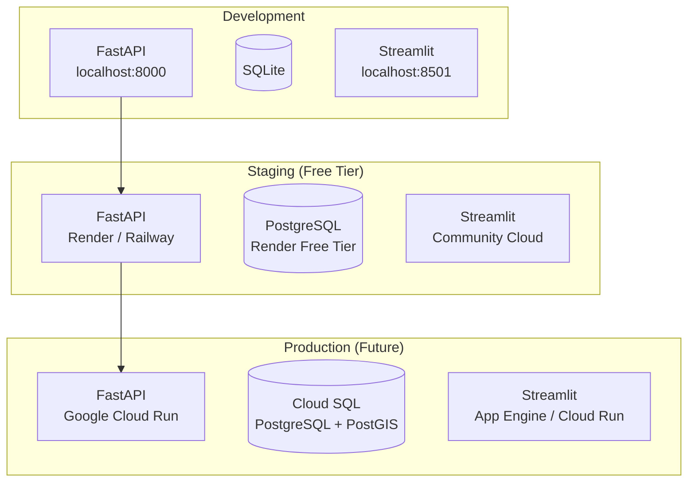
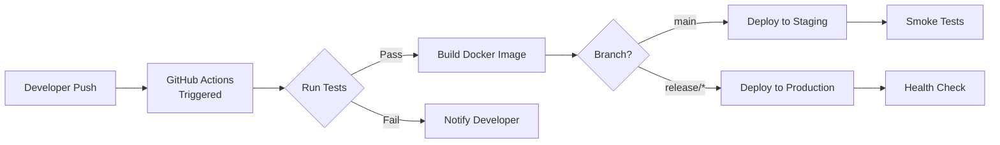

# Deliverable 1 – Project Understanding & System Architecture

## AI-Enabled Geospatial Decision Support System for Climate-Resilient WASH Planning

---

## 1. Project Overview

### 1.1 Problem Statement

Climate change exacerbates the vulnerability of communities by affecting water availability, increasing the frequency of extreme weather events, and driving environmental degradation. Water, Sanitation, and Hygiene (WASH) infrastructure planning often lacks actionable, high-resolution geospatial insights to prioritize interventions effectively. Planners and NGOs need a data-driven way to assess environmental risks and climate vulnerability — not a retrospective view of existing infrastructure — to allocate scarce resources where they are most urgently needed.

### 1.2 Solution

This project builds an **AI-Enabled Geospatial Decision Support System** that identifies key **environmental and climate risks** influencing WASH planning. By analyzing satellite imagery via Google Earth Engine and applying machine learning or statistical modeling, the system assesses climate vulnerability and generates a **WASH Intervention Priority Index (0–100)**. This index helps NGOs and policymakers prioritize areas for WASH interventions based on environmental stress and vulnerability — turning raw satellite data into actionable intelligence.

> [!IMPORTANT]
> The system does **not** attempt to measure existing WASH service levels. WASH access depends on socioeconomic factors, household-level infrastructure, and local governance — none of which are reliably observable from satellite imagery. Instead, the system focuses on environmental *drivers* that influence where WASH interventions should be directed.

### 1.3 What This System Does NOT Do

*   **Measure Existing WASH Levels:** WASH access heavily depends on socioeconomic factors, household-level infrastructure, and local governance, which cannot be reliably observed from satellite imagery alone. The system makes no claim to quantify current water or sanitation coverage.
*   **Replace Ground Truth:** The system highlights vulnerable regions to *guide* ground surveys and intervention planning; it does not replace the need for field verification.
*   **Design Engineering Solutions:** It identifies *where* interventions are needed most, not *how* to engineer specific water or sanitation facilities.
*   **Provide Real-Time Monitoring:** The system works on periodic batch analysis of satellite data, not live sensor feeds.

### 1.4 Target Users

*   **NGO Project Managers & Field Coordinators** — to prioritize field deployments and resource allocation.
*   **Government Planners & Policymakers** — to inform regional WASH investment strategies.
*   **WASH Researchers & Climate Analysts** — to study environmental drivers of WASH vulnerability.
*   **Donor Organizations** — to understand where funding will have the greatest impact.

---

## 2. System Architecture

### 2.1 High-Level Architecture Diagram



### 2.2 Architecture Pattern

The system follows a **modular, multi-tier architecture** with clearly defined boundaries:

| Layer | Responsibility | Components |
| :--- | :--- | :--- |
| **1. Data Layer** | External APIs (GEE, OSM) and internal relational database | `src/acquisition/`, Database |
| **2. Processing Layer** | Fetching data, calculating environmental indices and derived anomalies | `src/processing/` |
| **3. Analytics & ML Layer** | Machine learning models (Supervised or Unsupervised) to generate vulnerability scores | `src/ml/` |
| **4. Priority Engine Layer** | Ingests vulnerability assessments and environmental indicators to compute the WASH Intervention Priority Index and generate human-readable explanations | `src/priority/` |
| **5. Service Layer** | FastAPI for serving predictions, priority scores, and data to the frontend | `src/api/` |
| **6. Presentation Layer** | Streamlit for interactive maps, charts, and downloadable reports | `src/dashboard/` |

### 2.3 Design Principles

*   **Modularity:** Each engine (Processing, ML, Priority) operates independently with well-defined interfaces.
*   **Scalability:** Designed to handle increasing data volumes and geographic scope without architectural changes.
*   **Interpretability:** Priority scores must be accompanied by explanations to build trust with non-technical stakeholders.
*   **Resilience:** Fallbacks for ML (e.g., K-Means clustering or weighted environmental risk models if labeled data is scarce).
*   **Reproducibility:** All processing and scoring steps are deterministic and version-controlled.
*   **Separation of Concerns:** Analytical scores (vulnerability) are kept separate from action-oriented scores (priority) to allow independent calibration.

---

## 3. Folder Structure

```text
AI-GEO-NGO/
├── data/                          # Local data storage
│   ├── raw/                       #   Raw satellite exports & downloads
│   ├── processed/                 #   Cleaned, feature-engineered data
│   └── models/                    #   Serialized trained models
├── docs/                          # Documentation
│   └── architecture.md            #   This document
├── notebooks/                     # Jupyter notebooks for EDA & prototyping
│   ├── 01_data_exploration.ipynb
│   ├── 02_index_calculation.ipynb
│   ├── 03_model_training.ipynb
│   └── 04_priority_analysis.ipynb
├── src/                           # Source code
│   ├── acquisition/               # Module 1: Data Acquisition
│   │   ├── __init__.py
│   │   ├── gee_client.py          #   Google Earth Engine interface
│   │   └── osm_client.py          #   OpenStreetMap data fetcher
│   ├── processing/                # Module 2: Geospatial Processing
│   │   ├── __init__.py
│   │   ├── vegetation.py          #   NDVI calculation
│   │   ├── water.py               #   NDWI calculation
│   │   ├── temperature.py         #   LST calculation
│   │   ├── vegetation_change.py   #   Long-term vegetation trends
│   │   ├── urban_growth.py        #   Urban expansion detection
│   │   ├── water_change.py        #   Surface water body change detection
│   │   ├── heat_stress.py         #   Heat stress index computation
│   │   └── rainfall_anomaly.py    #   Precipitation deviation analysis
│   ├── ml/                        # Module 3: Machine Learning Engine
│   │   ├── __init__.py
│   │   ├── features.py            #   Feature engineering & selection
│   │   ├── train.py               #   Model training (RF, optionally XGBoost)
│   │   ├── predict.py             #   Inference & scoring
│   │   └── clustering.py          #   K-Means unsupervised clustering
│   ├── priority/                  # Module 4: WASH Priority Engine [NEW]
│   │   ├── __init__.py
│   │   ├── engine.py              #   Priority Index calculation orchestrator
│   │   ├── scoring.py             #   Weighted scoring functions
│   │   └── explainer.py           #   Human-readable explanation generator
│   ├── api/                       # Module 5: API Backend
│   │   ├── __init__.py
│   │   ├── main.py                #   FastAPI application entry point
│   │   ├── routes.py              #   Route definitions
│   │   └── schemas.py             #   Pydantic request/response models
│   ├── dashboard/                 # Module 6: Interactive Dashboard
│   │   ├── __init__.py
│   │   ├── app.py                 #   Streamlit main application
│   │   ├── pages/
│   │   │   ├── 01_overview.py               # System overview & KPIs
│   │   │   ├── 02_vulnerability_map.py      # ML vulnerability heatmap
│   │   │   ├── 03_ndvi_analysis.py          # NDVI spatial analysis
│   │   │   ├── 04_ndwi_analysis.py          # NDWI spatial analysis
│   │   │   ├── 05_lst_analysis.py           # Land Surface Temperature
│   │   │   ├── 06_vegetation_change.py      # Vegetation change over time
│   │   │   ├── 07_water_body_change.py      # Water body gain/loss map
│   │   │   ├── 08_urban_expansion.py        # Urban growth detection
│   │   │   ├── 09_wash_priority.py          # WASH Intervention Priority Map
│   │   │   ├── 10_cluster_analysis.py       # K-Means clustering results
│   │   │   └── 11_reports.py                # PDF report generation
│   │   └── components/
│   │       ├── sidebar.py         #   Reusable sidebar component
│   │       └── map_utils.py       #   Folium map helpers
│   └── utils/                     # Shared utilities
│       ├── __init__.py
│       ├── config.py              #   Configuration management
│       ├── logger.py              #   Logging setup
│       └── constants.py           #   Shared constants & thresholds
├── tests/                         # Unit & integration tests
│   ├── test_processing.py
│   ├── test_ml.py
│   ├── test_priority.py
│   └── test_api.py
├── .env.example                   # Environment variable template
├── .gitignore
├── requirements.txt
├── Dockerfile                     # Container definition
├── docker-compose.yml             # Multi-service orchestration
└── README.md
```

---

## 4. Technology Stack

| Category | Technology | Purpose |
| :--- | :--- | :--- |
| **Language** | Python 3.10+ | Core development language |
| **Geospatial Processing** | Google Earth Engine Python API (`ee`) | Satellite imagery access & server-side computation |
| | `geopandas`, `rasterio`, `shapely` | Local geospatial data manipulation |
| **Machine Learning** | `scikit-learn` (Random Forest, K-Means) | Primary ML framework — classification, clustering |
| | `xgboost` *(Optional)* | Gradient boosting — use when labeled data is sufficient |
| | `pandas`, `numpy` | Data manipulation & numerical computing |
| **Backend & API** | `FastAPI`, `uvicorn` | High-performance REST API |
| | `SQLAlchemy` | ORM for database operations |
| **Database** | `SQLite` (Development) | Lightweight local database |
| | `PostgreSQL` + `PostGIS` (Production) | Spatial-aware production database |
| **Frontend UI** | `Streamlit` | Rapid dashboard development |
| | `folium` / `streamlit-folium` | Interactive map rendering |
| | `plotly` | Interactive charts & visualizations |
| **Reporting** | `fpdf2` | Automated PDF report generation |
| **Deployment & DevOps** | Docker, `docker-compose` | Containerization & orchestration |
| | GitHub Actions | CI/CD pipeline |
| | Render / Railway / GCP | Cloud hosting platforms |

---

## 5. Data Flow Diagram

### 5.1 Pipeline Flow



### 5.2 Pipeline Stages Summary

| Stage | Action | Component | Output |
| :--- | :--- | :--- | :--- |
| **1. Ingestion** | Fetch satellite imagery, climate data (CHIRPS), & OSM data | `src/acquisition/` | Raw GeoTIFFs, GeoJSON, CSV |
| **2. Processing** | Compute base indices (NDVI, NDWI, LST) and derived indicators (Vegetation Change, Water Body Change, Heat Stress Index, Rainfall Anomaly, Urban Growth) | `src/processing/` | Engineered feature matrix (DataFrame) |
| **3. Modeling** | Predict vulnerability via supervised learning (Random Forest, optionally XGBoost) or cluster regions via unsupervised methods (K-Means, Weighted Risk Model) | `src/ml/` | Vulnerability Score, Vulnerability Category, Confidence Score, Feature Importance |
| **4. Prioritization** | Calculate WASH Intervention Priority Index and generate human-readable explanations | `src/priority/` | Priority Score (0–100), Priority Class, Explanation |
| **5. Storage** | Persist all results to the relational database | Database layer | Stored records |
| **6. Serving** | Expose data and trigger computations via REST endpoints | `src/api/` | JSON API responses |
| **7. Visualization** | Render interactive maps, time-series charts, and downloadable PDF reports | `src/dashboard/` | Interactive UI (~11 pages) |

---

## 6. Database Schema

### 6.1 Entity-Relationship Diagram



### 6.2 Priority Class Definitions

| Priority Score Range | Priority Class | Interpretation |
| :--- | :--- | :--- |
| **0 – 40** | 🟢 Low Priority | Environmental conditions are relatively stable; routine monitoring recommended. |
| **41 – 70** | 🟡 Medium Priority | Emerging environmental stressors detected; proactive planning advised. |
| **71 – 100** | 🔴 High Priority | Severe environmental stress; immediate WASH intervention should be considered. |

---

## 7. API Architecture

### 7.1 Endpoint Summary

The FastAPI backend exposes the following RESTful endpoints:

| Method | Endpoint | Description |
| :--- | :--- | :--- |
| `GET` | `/regions` | List all monitored regions with basic metadata |
| `GET` | `/regions/{region_id}` | Get detailed info for a specific region |
| `GET` | `/data/{region_id}` | Get environmental indices for a region |
| `GET` | `/predict/{region_id}` | Fetch or trigger ML vulnerability prediction |
| `POST` | `/predict/batch` | Trigger batch vulnerability prediction |
| `GET` | `/priority` | Get WASH priority list for all regions |
| `GET` | `/priority/{region_id}` | Get detailed WASH priority for a specific region |
| `POST` | `/priority/compute` | Trigger batch priority computation |
| `GET` | `/priority/summary` | Get aggregated statistics on priority classes |
| `GET` | `/reports/{region_id}` | Generate & download a PDF report |

### 7.2 Example Response: `GET /priority/{region_id}`

```json
{
  "region_id": "REG-104",
  "region_name": "Turkana West",
  "priority_score": 82.5,
  "priority_class": "High Priority",
  "vulnerability_score": 0.88,
  "vulnerability_category": "High",
  "confidence_score": 0.76,
  "explanation": "High priority assigned due to severe water body depletion (-15.3% over 5 years) coupled with a high heat stress index (92nd percentile) and rapid urban expansion (+8.2% annually). Vegetation degradation further compounds the risk.",
  "top_contributing_factors": {
    "water_body_change": 0.35,
    "heat_stress_index": 0.28,
    "urban_growth_rate": 0.18,
    "vegetation_change": 0.12,
    "rainfall_anomaly": 0.07
  },
  "model_type": "RandomForest",
  "computed_at": "2026-07-18T12:00:00Z"
}
```

### 7.3 Example Response: `GET /priority/summary`

```json
{
  "total_regions": 150,
  "summary": {
    "high_priority": { "count": 42, "percentage": 28.0 },
    "medium_priority": { "count": 63, "percentage": 42.0 },
    "low_priority": { "count": 45, "percentage": 30.0 }
  },
  "average_priority_score": 55.2,
  "last_computed": "2026-07-18T12:00:00Z"
}
```

---

## 8. Module Breakdown

### Module 1: Data Acquisition (`src/acquisition/`)

| File | Responsibility |
| :--- | :--- |
| `gee_client.py` | Authenticates with Google Earth Engine; retrieves Sentinel-2, Landsat, and CHIRPS precipitation datasets for specified regions and date ranges. |
| `osm_client.py` | Fetches OpenStreetMap data for infrastructure/settlement proxies (roads, buildings, water points). |

**Optional Data Source:** NGO WASH Infrastructure Data — if available, can be ingested as supplementary ground-truth information via a custom loader.

### Module 2: Geospatial Processing (`src/processing/`)

Computes base environmental indices and derived indicators:

#### Base Indices

| File | Index | Formula |
| :--- | :--- | :--- |
| `vegetation.py` | NDVI (Normalized Difference Vegetation Index) | $\text{NDVI} = \frac{NIR - Red}{NIR + Red}$ |
| `water.py` | NDWI (Normalized Difference Water Index) | $\text{NDWI} = \frac{Green - NIR}{Green + NIR}$ |
| `temperature.py` | LST (Land Surface Temperature) | Derived from Landsat thermal bands (Band 10/11), converted to Celsius. |

#### Derived Indicators

| File | Indicator | Description | Method |
| :--- | :--- | :--- | :--- |
| `vegetation_change.py` | Vegetation Change | Long-term NDVI trends indicating greening or browning | Linear regression on NDVI time series; $\Delta\text{NDVI} = \text{NDVI}_{t} - \text{NDVI}_{t-n}$ |
| `urban_growth.py` | Urban Growth Rate | Expansion of built-up areas over time | Classification of built-up pixels using nighttime lights or land-use classification; rate = $\frac{A_{t} - A_{t-n}}{A_{t-n}} \times 100$ |
| `water_change.py` | Water Body Change | Changes in surface water extent | NDWI thresholding across time periods; $\Delta\text{Water} = \text{WaterExtent}_{t} - \text{WaterExtent}_{t-n}$ |
| `heat_stress.py` | Heat Stress Index | Identifies periods of extreme LST relative to historical baselines | $\text{HSI} = \frac{\text{LST}_{obs} - \text{LST}_{mean}}{\text{LST}_{std}}$; values > 2.0 indicate extreme heat stress |
| `rainfall_anomaly.py` | Rainfall Anomaly | Deviations from average precipitation patterns | $\text{RA} = \frac{P_{obs} - P_{mean}}{P_{std}}$ using CHIRPS precipitation data |

### Module 3: Machine Learning Engine (`src/ml/`)

Generates the core vulnerability assessment. The system supports **dual-track modeling** based on data availability:



#### Supervised Path (If labeled data is available)

| Model | Role | Details |
| :--- | :--- | :--- |
| **Random Forest** | Primary classifier/regressor | Robust, interpretable; built-in feature importance via `scikit-learn` |
| **XGBoost** *(Optional)* | Secondary model for comparison | Higher potential accuracy; use when sufficient labeled data exists |

#### Unsupervised Path (If labeled data is unavailable)

| Method | Role | Details |
| :--- | :--- | :--- |
| **K-Means Clustering** | Primary fallback | Groups regions into $k$ clusters based on environmental features; clusters are then mapped to Low/Medium/High categories |
| **Weighted Environmental Risk Model** | Alternative fallback | Expert-defined weights for each indicator; $\text{Score} = \sum_{i} w_i \cdot x_i$ where $w_i$ are weights and $x_i$ are normalized indicators |

#### ML Feature Set

| Feature | Source | Description |
| :--- | :--- | :--- |
| NDVI | `processing/vegetation.py` | Current vegetation health |
| NDWI | `processing/water.py` | Current surface water presence |
| LST | `processing/temperature.py` | Land surface temperature |
| Vegetation Change | `processing/vegetation_change.py` | NDVI trend over baseline period |
| Urban Growth Rate | `processing/urban_growth.py` | Rate of built-up area expansion |
| Water Body Change | `processing/water_change.py` | Change in surface water extent |
| Heat Stress Index | `processing/heat_stress.py` | Extreme temperature anomaly metric |
| Rainfall Anomaly | `processing/rainfall_anomaly.py` | Precipitation deviation |
| Population Density | `acquisition/osm_client.py` | Estimated settlement density from OSM |

#### ML Outputs

| Output | Type | Description |
| :--- | :--- | :--- |
| **Climate Vulnerability Score** | `float (0.0–1.0)` | Normalized vulnerability assessment |
| **Vulnerability Category** | `string` | Low / Medium / High |
| **Confidence Score** | `float (0.0–1.0)` | Model confidence; `null` for unsupervised methods |
| **Feature Importance** | `dict` | Contribution weight of each feature to the prediction |

### Module 4: WASH Intervention Priority Engine (`src/priority/`) 🆕

This is a **new, dedicated module** that sits between the ML Engine and the API/Dashboard layers. It transforms raw vulnerability assessments into actionable priority recommendations.

#### `engine.py` — Priority Calculation Orchestrator

Ingests vulnerability assessments and environmental indicators to calculate the **WASH Intervention Priority Index (0–100)**:

| Priority Score | Priority Class | Action Guidance |
| :--- | :--- | :--- |
| **0 – 40** | 🟢 Low Priority | Routine monitoring; no immediate action required |
| **41 – 70** | 🟡 Medium Priority | Proactive planning recommended; emerging risks detected |
| **71 – 100** | 🔴 High Priority | Immediate attention; severe environmental stress identified |

**Scoring Formula (Conceptual):**

$$\text{Priority Score} = \alpha \cdot V_{score} + \sum_{j} \beta_j \cdot E_j$$

Where:
*   $V_{score}$ = Climate Vulnerability Score from ML Engine
*   $E_j$ = Normalized environmental indicator $j$ (water body change, heat stress, rainfall anomaly, etc.)
*   $\alpha, \beta_j$ = Configurable weights (calibrated with NGO partners)

#### `scoring.py` — Weighted Scoring Functions

Contains the weighting logic for combining factors. Supports context-sensitive weighting (e.g., weighting water body change higher in drought-prone areas, weighting heat stress higher in arid regions).

```python
# Example scoring logic (simplified)
def compute_priority_score(vulnerability_score, indicators, weights):
    """
    Compute WASH Intervention Priority Index.
    
    Returns: float (0-100)
    """
    base = vulnerability_score * weights['vulnerability'] * 100
    env_contribution = sum(
        indicators[k] * weights.get(k, 0) for k in indicators
    )
    raw_score = base + env_contribution
    return min(max(raw_score, 0), 100)  # Clamp to 0-100
```

#### `explainer.py` — Explanation Generator

Generates human-readable explanations of *why* an area received its priority score based on the highest contributing factors. Each explanation includes:

*   The top contributing environmental factors
*   Magnitude and direction of each factor (e.g., "water bodies decreased by 15%")
*   Actionable context (e.g., "suggests increasing water stress")

### Module 5: API Backend (`src/api/`)

FastAPI application serving data and triggering computations. See [Section 7](#7-api-architecture) for full endpoint documentation.

### Module 6: Interactive Dashboard (`src/dashboard/`)

Streamlit app with **~11 pages** providing comprehensive visualization:

| Page | File | Description |
| :--- | :--- | :--- |
| 1. Overview | `01_overview.py` | System summary, KPI cards, region count, average priority |
| 2. Vulnerability Map | `02_vulnerability_map.py` | ML-generated vulnerability heatmap with filters |
| 3. NDVI Analysis | `03_ndvi_analysis.py` | Spatial NDVI distribution and statistics |
| 4. NDWI Analysis | `04_ndwi_analysis.py` | Surface water index visualization |
| 5. LST Analysis | `05_lst_analysis.py` | Land Surface Temperature mapping |
| 6. Vegetation Change | `06_vegetation_change.py` | Temporal vegetation change map (greening/browning) |
| 7. Water Body Change | `07_water_body_change.py` | Water body gain/loss map over time |
| 8. Urban Expansion | `08_urban_expansion.py` | Urban growth detection and rate visualization |
| 9. WASH Priority | `09_wash_priority.py` | **WASH Intervention Priority Map** with explanations |
| 10. Cluster Analysis | `10_cluster_analysis.py` | K-Means clustering results & silhouette analysis |
| 11. Reports | `11_reports.py` | PDF report generation and download |

---

## 9. Development Roadmap



### Phase Details

| Phase | Weeks | Key Deliverables |
| :--- | :--- | :--- |
| **Phase 1: Foundation** | 1–2 | Project setup, GEE authentication, database schema design, basic API scaffolding, environment configuration |
| **Phase 2: Data & Processing Pipeline** | 3–5 | GEE extraction scripts, base index calculation (NDVI, NDWI, LST), derived indicators (Water Body Change, Heat Stress Index, Rainfall Anomaly, Vegetation Change, Urban Growth) |
| **Phase 3: ML & Priority Engine** | 6–8 | Feature engineering, K-Means clustering implementation, Random Forest training, WASH Intervention Priority Engine development (scoring logic + explainer), model evaluation |
| **Phase 4: Dashboard & Integration** | 9–10 | API-to-database integration, all 11 Streamlit dashboard pages (including Vegetation Change, Water Body Change, Urban Expansion, WASH Priority), PDF report generation with `fpdf2` |
| **Phase 5: Deployment & Refinement** | 11–12 | Docker containerization, CI/CD pipeline with GitHub Actions, staging deployment to Render/Railway, end-to-end testing, documentation, priority index calibration with NGO feedback |

---

## 10. Labeling & Modeling Strategy

Since ground-truth data on WASH vulnerability is often scarce, the system employs a **flexible, multi-strategy approach**:



| Strategy | When to Use | Method |
| :--- | :--- | :--- |
| **1. K-Means Clustering** *(Primary Fallback)* | Labeled data unavailable | Groups regions by environmental feature similarity into $k$ clusters (typically 3: Low/Medium/High). Cluster centers provide interpretable archetypes. |
| **2. Weighted Environmental Risk Model** | Labeled data unavailable; domain expertise available | Experts assign weights to indicators (e.g., water depletion = 35%, heat stress = 25%, vegetation loss = 20%, rainfall deficit = 15%, urban density = 5%). Score = weighted sum of normalized indicators. |
| **3. Composite Scoring** | General-purpose scoring | Combining multiple normalized indices into a single representative vulnerability score. |
| **4. Expert Annotation** *(If possible)* | Partial labels available | NGOs provide vulnerability labels for a subset of regions, enabling supervised model training (Random Forest). Active learning can iteratively expand labeled data. |

> [!TIP]
> The system is designed to **start unsupervised** (K-Means or weighted model) and **transition to supervised** learning as labeled data becomes available through NGO field operations. This ensures the system is immediately operational.

---

## 11. Key Design Decisions

| # | Decision | Rationale |
| :--- | :--- | :--- |
| **1** | **Reframing the AI Goal:** Identify environmental *drivers* of WASH vulnerability instead of measuring WASH infrastructure directly | Satellite imagery cannot reliably observe socioeconomic factors, household plumbing, or governance quality. Environmental risk factors (drought, heat, water depletion) *are* observable and strongly correlate with WASH needs. |
| **2** | **Dual-Track ML Pipeline:** Support both supervised and unsupervised approaches | Ensures the system is operational even without labeled data. K-Means and weighted risk models provide immediate value; supervised models improve accuracy when labels become available. |
| **3** | **Separate Vulnerability Score from Priority Index** | Vulnerability Score is a purely analytical output of the ML engine. The Priority Index is an action-oriented score that can incorporate policy-based weighting, context-sensitive factors, and human-readable explanations — enabling trust and adoption. |
| **4** | **XGBoost as Optional** | Random Forest provides sufficient accuracy with built-in interpretability. XGBoost adds complexity; only justified when labeled data is abundant and marginal accuracy gains matter. |
| **5** | **WASH Priority Engine as Dedicated Module** | Separating priority computation from ML prediction allows independent calibration, testing, and iteration with NGO partners without disrupting the core ML pipeline. |
| **6** | **SQLite for Development, PostgreSQL for Production** | SQLite eliminates deployment friction during development; PostgreSQL + PostGIS provides spatial query capabilities at scale. |

---

## 12. Risk & Mitigation

| Risk | Impact | Mitigation Strategy |
| :--- | :--- | :--- |
| 🔴 **GEE Quota Limits** | High | Implement local caching of GEE exports, spatial subsetting to reduce payload, and optimize GEE server-side computations to minimize data transfer. |
| 🔴 **Lack of Labeled Data** | High | Design the system to be fully operational with unsupervised methods (K-Means, Weighted Risk Model). Composite environmental indicators provide meaningful outputs without labels. |
| 🟡 **Priority Index Calibration** | Medium | Work closely with NGO partners to iteratively adjust the weights in the `scoring.py` module. Conduct field validation to compare priority scores against observed WASH needs. |
| 🟡 **Dashboard Performance** | Medium | Use simplified geometries (topojson) for rendering large areas in Folium/Streamlit. Pre-calculate and cache scores in the database to avoid real-time computation. |
| 🟡 **Model Drift Over Time** | Medium | Implement periodic retraining schedules. Monitor feature distributions for significant shifts. Version all models in `data/models/`. |
| 🟢 **Satellite Data Gaps** | Low | Use multi-source imagery (Sentinel-2 + Landsat) to improve temporal coverage. Implement cloud-masking and compositing strategies in GEE. |
| 🟢 **Scope Creep** | Low | Maintain strict module boundaries. New features must fit within the defined architecture or justify an architectural extension through documentation. |

---

## 13. Deployment Strategy

The system is designed for a **phased rollout** to balance cost, complexity, and scale:

### 13.1 Deployment Architecture



### 13.2 Environment Details

| Environment | API Hosting | Database | Dashboard | Cost |
| :--- | :--- | :--- | :--- | :--- |
| **Development** | Local machine (`uvicorn`) | SQLite | Local Streamlit | Free |
| **Staging (PoC)** | Render / Railway (free tier) | Render PostgreSQL (free tier) or SQLite in container | Streamlit Community Cloud | Free |
| **Production** | Google Cloud Run | Cloud SQL (PostgreSQL + PostGIS) | App Engine or Cloud Run | Pay-as-you-go |

### 13.3 CI/CD Pipeline



**GitHub Actions Workflow:**
1. **On Push/PR:** Lint (`flake8`), unit tests (`pytest`), type checks (`mypy`)
2. **On Merge to `main`:** Build Docker image → Push to registry → Deploy to staging
3. **On Release Tag:** Deploy to production environment

### 13.4 Containerization

```dockerfile
# Dockerfile structure (conceptual)
FROM python:3.10-slim

# Install system dependencies for geospatial libs
RUN apt-get update && apt-get install -y libgdal-dev

# Install Python dependencies
COPY requirements.txt .
RUN pip install --no-cache-dir -r requirements.txt

# Copy application code
COPY src/ /app/src/
COPY data/ /app/data/

# Expose ports
EXPOSE 8000 8501

# Entrypoint
CMD ["uvicorn", "src.api.main:app", "--host", "0.0.0.0", "--port", "8000"]
```

> [!NOTE]
> A `docker-compose.yml` is provided to orchestrate the FastAPI backend and Streamlit frontend together, along with a PostgreSQL container for local production-like testing.

---

## Appendix: Glossary

| Term | Definition |
| :--- | :--- |
| **WASH** | Water, Sanitation, and Hygiene |
| **NDVI** | Normalized Difference Vegetation Index — measures vegetation health |
| **NDWI** | Normalized Difference Water Index — measures surface water presence |
| **LST** | Land Surface Temperature — thermal measurement from satellite |
| **GEE** | Google Earth Engine — cloud platform for planetary-scale geospatial analysis |
| **CHIRPS** | Climate Hazards Group InfraRed Precipitation with Station data |
| **Priority Index** | WASH Intervention Priority Index (0–100) — action-oriented score |
| **Vulnerability Score** | ML-generated climate vulnerability assessment (0.0–1.0) |
