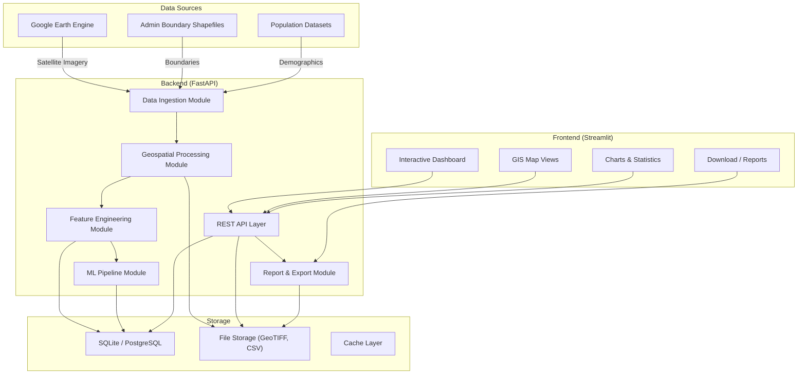
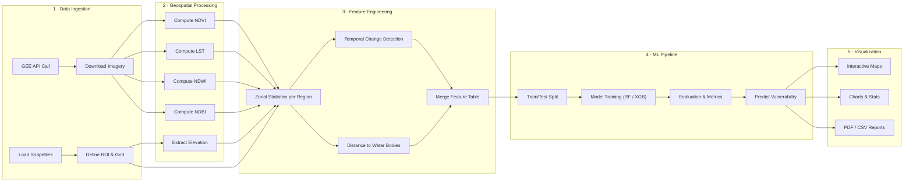
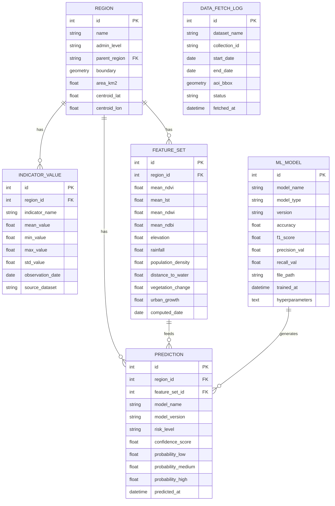
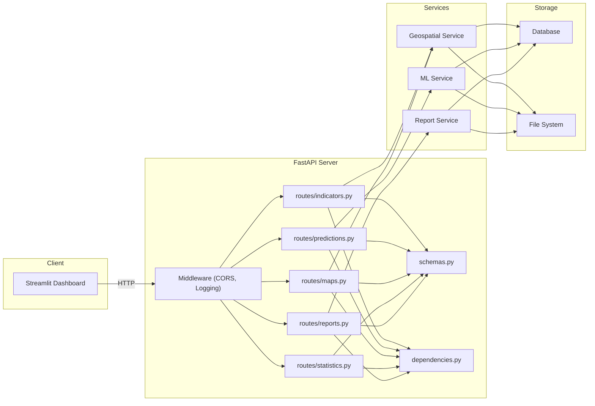
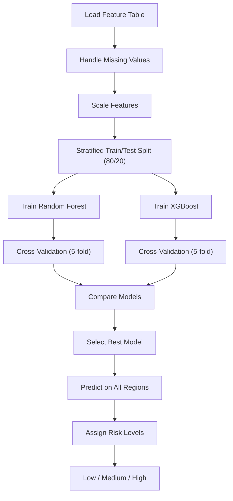
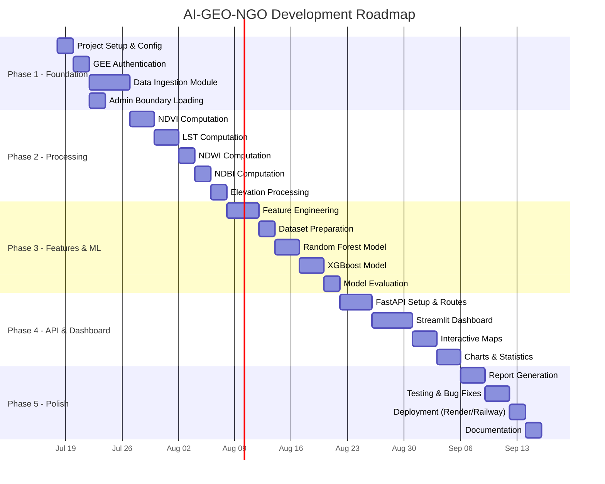

# Deliverable 1 – Project Understanding & System Architecture

## AI-Enabled Geospatial Decision Support System for Climate-Resilient WASH Planning

---

## 1. Project Overview

### 1.1 Problem Statement

Climate change is intensifying water scarcity, sanitation failures, and hygiene-related health risks across vulnerable regions. NGOs and policymakers lack an integrated, data-driven system to identify climate-vulnerable areas and prioritize WASH (Water, Sanitation and Hygiene) interventions efficiently.

### 1.2 Solution

An AI-enabled geospatial decision support system that:

1. **Ingests** satellite imagery from Google Earth Engine (Sentinel-2, Landsat 8/9, SRTM DEM, CHIRPS)
2. **Extracts** environmental indicators (NDVI, LST, NDWI, NDBI)
3. **Engineers** ML features per administrative region or grid cell
4. **Predicts** climate vulnerability / WASH priority levels using Random Forest & XGBoost
5. **Visualizes** results on an interactive GIS dashboard with downloadable reports

### 1.3 Target Users

| User | Need |
|------|------|
| NGO Field Teams | Identify high-risk areas for intervention planning |
| Policymakers | Data-backed decision making for resource allocation |
| Researchers | Access to processed geospatial & climate data |
| Donors | Visual evidence of impact & priority areas |

---

## 2. System Architecture

### 2.1 High-Level Architecture Diagram



### 2.2 Architecture Pattern

The system follows a **modular layered architecture** with clear separation of concerns:

| Layer | Responsibility | Technology |
|-------|---------------|------------|
| **Data Ingestion** | Fetch & cache satellite data from GEE | `earthengine-api`, Python |
| **Geospatial Processing** | Compute NDVI, LST, NDWI, NDBI rasters | `rasterio`, `geopandas`, GEE |
| **Feature Engineering** | Aggregate indicators per region/grid | `pandas`, `numpy`, `geopandas` |
| **ML Pipeline** | Train, evaluate, predict vulnerability | `scikit-learn`, `xgboost` |
| **API Layer** | Expose endpoints for frontend consumption | `FastAPI`, `uvicorn` |
| **Frontend** | Interactive dashboard & visualizations | `Streamlit`, `folium`, `plotly` |
| **Storage** | Persist features, predictions, models | `SQLite`/`PostgreSQL`, filesystem |

### 2.3 Design Principles

- **Modularity** — Each component is independently developable, testable, and replaceable
- **Separation of Concerns** — Data ingestion, processing, ML, and presentation are decoupled
- **Reproducibility** — All GEE queries, feature pipelines, and ML experiments are versioned
- **Scalability** — Can start with SQLite and migrate to PostgreSQL/Cloud SQL later
- **Offline-First** — Once data is fetched from GEE, the system works fully offline

---

## 3. Folder Structure

```
AI-GEO-NGO/
│
├── README.md                          # Project documentation
├── requirements.txt                   # Python dependencies
├── .env.example                       # Environment variable template
├── .gitignore                         # Git ignore rules
├── setup.py                           # Package setup (optional)
│
├── config/
│   ├── __init__.py
│   ├── settings.py                    # App configuration & constants
│   └── gee_config.py                  # GEE authentication & project config
│
├── data/
│   ├── raw/                           # Raw downloaded data (GeoTIFFs, CSVs)
│   │   ├── sentinel2/
│   │   ├── landsat/
│   │   ├── srtm/
│   │   ├── chirps/
│   │   └── shapefiles/
│   ├── processed/                     # Processed indicator rasters
│   │   ├── ndvi/
│   │   ├── lst/
│   │   ├── ndwi/
│   │   └── ndbi/
│   ├── features/                      # Engineered feature tables
│   │   └── region_features.csv
│   └── predictions/                   # ML prediction outputs
│       └── vulnerability_scores.csv
│
├── src/
│   ├── __init__.py
│   │
│   ├── ingestion/                     # Module 1: Data Ingestion
│   │   ├── __init__.py
│   │   ├── gee_client.py             # GEE authentication & session
│   │   ├── sentinel2.py              # Sentinel-2 imagery fetcher
│   │   ├── landsat.py                # Landsat 8/9 imagery fetcher
│   │   ├── srtm.py                   # SRTM DEM fetcher
│   │   ├── chirps.py                 # CHIRPS rainfall fetcher
│   │   └── boundaries.py            # Admin boundary loader
│   │
│   ├── processing/                    # Module 2: Geospatial Processing
│   │   ├── __init__.py
│   │   ├── ndvi.py                   # NDVI computation
│   │   ├── lst.py                    # LST computation
│   │   ├── ndwi.py                   # NDWI computation
│   │   ├── ndbi.py                   # NDBI computation
│   │   ├── elevation.py             # Elevation processing
│   │   └── utils.py                  # Common raster utilities
│   │
│   ├── features/                      # Module 3: Feature Engineering
│   │   ├── __init__.py
│   │   ├── extractor.py             # Zonal statistics per region
│   │   ├── derived.py               # Derived features (change, distance)
│   │   ├── aggregator.py            # Merge all features into table
│   │   └── scaler.py                # Feature scaling & normalization
│   │
│   ├── ml/                            # Module 4: Machine Learning
│   │   ├── __init__.py
│   │   ├── dataset.py               # Train/test split & data loading
│   │   ├── random_forest.py         # Random Forest model
│   │   ├── xgboost_model.py         # XGBoost model
│   │   ├── trainer.py               # Training orchestration
│   │   ├── evaluator.py             # Metrics & evaluation
│   │   ├── predictor.py             # Inference on new regions
│   │   └── explainer.py             # Feature importance & SHAP
│   │
│   ├── api/                           # Module 5: FastAPI Backend
│   │   ├── __init__.py
│   │   ├── main.py                   # FastAPI app entry point
│   │   ├── routes/
│   │   │   ├── __init__.py
│   │   │   ├── indicators.py        # Indicator data endpoints
│   │   │   ├── predictions.py       # Vulnerability prediction endpoints
│   │   │   ├── maps.py              # Map tile / GeoJSON endpoints
│   │   │   ├── statistics.py        # Aggregated stats endpoints
│   │   │   └── reports.py           # Report generation endpoints
│   │   ├── schemas.py               # Pydantic request/response models
│   │   └── dependencies.py          # Shared dependencies & DB session
│   │
│   ├── dashboard/                     # Module 6: Streamlit Frontend
│   │   ├── __init__.py
│   │   ├── app.py                    # Streamlit entry point
│   │   ├── pages/
│   │   │   ├── 01_overview.py       # Overview & statistics
│   │   │   ├── 02_ndvi_map.py       # NDVI interactive map
│   │   │   ├── 03_lst_map.py        # LST interactive map
│   │   │   ├── 04_ndwi_map.py       # NDWI interactive map
│   │   │   ├── 05_ndbi_map.py       # NDBI interactive map
│   │   │   ├── 06_vulnerability.py  # Climate vulnerability map
│   │   │   ├── 07_charts.py         # Charts & analytics
│   │   │   └── 08_reports.py        # Downloadable reports
│   │   ├── components/
│   │   │   ├── sidebar.py           # Sidebar filters & controls
│   │   │   ├── map_viewer.py        # Folium map component
│   │   │   └── chart_builder.py     # Plotly chart component
│   │   └── assets/
│   │       ├── style.css             # Custom CSS
│   │       └── logo.png              # NGO / project logo
│   │
│   └── utils/                         # Shared Utilities
│       ├── __init__.py
│       ├── io.py                     # File I/O helpers
│       ├── geo_utils.py             # CRS, bbox, geom helpers
│       ├── logger.py                # Logging configuration
│       └── constants.py             # Shared constants
│
├── models/                            # Saved ML models
│   ├── random_forest.joblib
│   └── xgboost_model.joblib
│
├── notebooks/                         # Jupyter notebooks for EDA
│   ├── 01_gee_exploration.ipynb
│   ├── 02_indicator_analysis.ipynb
│   ├── 03_feature_engineering.ipynb
│   └── 04_model_training.ipynb
│
├── tests/                             # Unit & integration tests
│   ├── __init__.py
│   ├── test_ingestion.py
│   ├── test_processing.py
│   ├── test_features.py
│   ├── test_ml.py
│   └── test_api.py
│
├── scripts/                           # Automation scripts
│   ├── fetch_data.py                 # End-to-end data fetch
│   ├── build_features.py            # Feature pipeline runner
│   ├── train_model.py               # Model training script
│   └── generate_report.py           # Report generation script
│
├── docs/                              # Documentation
│   ├── architecture.md
│   ├── api_reference.md
│   ├── deployment.md
│   └── user_guide.md
│
└── docker/                            # Docker configuration (future)
    ├── Dockerfile
    └── docker-compose.yml
```

---

## 4. Technology Stack

### 4.1 Detailed Stack Breakdown

| Category | Technology | Version | Purpose |
|----------|-----------|---------|---------|
| **Language** | Python | 3.10+ | Core language |
| **Backend** | FastAPI | 0.100+ | REST API framework |
| | Uvicorn | 0.23+ | ASGI server |
| | Pydantic | 2.0+ | Data validation & schemas |
| **ML** | Scikit-learn | 1.3+ | Random Forest, preprocessing |
| | XGBoost | 2.0+ | Gradient boosting model |
| | SHAP | 0.42+ | Model explainability |
| | Joblib | 1.3+ | Model serialization |
| **GIS** | earthengine-api | 0.1.370+ | Google Earth Engine SDK |
| | GeoPandas | 0.14+ | Vector geospatial operations |
| | Rasterio | 1.3+ | Raster I/O & processing |
| | Shapely | 2.0+ | Geometric operations |
| | Folium | 0.15+ | Interactive Leaflet maps |
| | Rasterstats | 0.19+ | Zonal statistics |
| **Frontend** | Streamlit | 1.28+ | Dashboard framework |
| | Plotly | 5.17+ | Interactive charts |
| | Streamlit-Folium | 0.15+ | Map integration |
| **Data** | Pandas | 2.1+ | Tabular data handling |
| | NumPy | 1.25+ | Numerical operations |
| **Database** | SQLite | (built-in) | Local development |
| | SQLAlchemy | 2.0+ | ORM (optional upgrade) |
| **DevOps** | Docker | latest | Containerization (future) |
| | GitHub Actions | — | CI/CD (future) |
| **Deployment** | Render / Railway | — | Cloud deployment |

### 4.2 Dependency Groups

```
# Core
fastapi, uvicorn, pydantic, python-dotenv

# Geospatial
earthengine-api, geopandas, rasterio, shapely, folium, rasterstats, pyproj

# Machine Learning
scikit-learn, xgboost, shap, joblib, imbalanced-learn

# Frontend
streamlit, streamlit-folium, plotly

# Data
pandas, numpy, scipy

# Utilities
requests, tqdm, loguru

# Testing
pytest, httpx
```

---

## 5. Data Flow Diagram

### 5.1 End-to-End Data Pipeline



### 5.2 Data Flow Per Stage

| Stage | Input | Process | Output | Storage |
|-------|-------|---------|--------|---------|
| **Ingestion** | GEE collection IDs, date range, AOI | Authenticate → Filter → Download | Raw GeoTIFF rasters | `data/raw/` |
| **Processing** | Raw bands (B4, B5, B8, B11, etc.) | Band math → Index computation | Indicator rasters (NDVI, LST, NDWI, NDBI) | `data/processed/` |
| **Feature Eng.** | Indicator rasters + admin boundaries | Zonal stats → Derive features → Merge | Feature table (CSV/DB) | `data/features/` + DB |
| **ML Pipeline** | Feature table + labels (if available) | Split → Train → Evaluate → Predict | Trained model + predictions | `models/` + `data/predictions/` |
| **Visualization** | Predictions + GeoJSON + feature table | Render maps, charts, reports | Interactive dashboard + PDFs | Browser + `data/reports/` |

---

## 6. Database Schema

### 6.1 Entity-Relationship Diagram



### 6.2 Table Descriptions

| Table | Purpose | Key Fields |
|-------|---------|------------|
| `region` | Administrative regions / grid cells | Name, boundary geometry, area |
| `indicator_value` | Time-series indicator values per region | NDVI/LST/NDWI/NDBI means, date |
| `feature_set` | Engineered ML features per region | All 10 features, computation date |
| `prediction` | Model predictions per region | Risk level, confidence, probabilities |
| `ml_model` | Model registry & performance tracking | Type, version, metrics, hyperparams |
| `data_fetch_log` | Audit trail for GEE data fetches | Dataset, date range, status |

### 6.3 Storage Strategy

| Phase | Database | Rationale |
|-------|----------|-----------|
| **Development** | SQLite | Zero config, file-based, good for prototyping |
| **Production** | PostgreSQL + PostGIS | Spatial queries, concurrent access, scalability |
| **Cloud (Future)** | Google Cloud SQL | Managed PostgreSQL with PostGIS |

---

## 7. API Architecture

### 7.1 API Design

The API follows **RESTful** conventions with versioned endpoints:

**Base URL**: `/api/v1`

### 7.2 Endpoint Specification

#### Regions

| Method | Endpoint | Description | Response |
|--------|----------|-------------|----------|
| `GET` | `/regions` | List all regions | `RegionList` |
| `GET` | `/regions/{id}` | Get region details + geometry | `RegionDetail` |
| `GET` | `/regions/{id}/geojson` | Get region GeoJSON | GeoJSON |

#### Indicators

| Method | Endpoint | Description | Response |
|--------|----------|-------------|----------|
| `GET` | `/indicators/{region_id}` | Get all indicators for a region | `IndicatorList` |
| `GET` | `/indicators/{region_id}/{type}` | Get specific indicator (ndvi/lst/ndwi/ndbi) | `IndicatorDetail` |
| `POST` | `/indicators/compute` | Trigger indicator computation | `TaskStatus` |

#### Features

| Method | Endpoint | Description | Response |
|--------|----------|-------------|----------|
| `GET` | `/features` | Get all feature sets | `FeatureTable` |
| `GET` | `/features/{region_id}` | Get features for a region | `FeatureSet` |
| `POST` | `/features/build` | Trigger feature engineering | `TaskStatus` |
| `GET` | `/features/download` | Download feature CSV | CSV file |

#### Predictions

| Method | Endpoint | Description | Response |
|--------|----------|-------------|----------|
| `GET` | `/predictions` | Get all predictions | `PredictionList` |
| `GET` | `/predictions/{region_id}` | Get prediction for a region | `PredictionDetail` |
| `POST` | `/predictions/run` | Run prediction on all regions | `TaskStatus` |
| `GET` | `/predictions/summary` | Aggregated risk statistics | `RiskSummary` |

#### Maps

| Method | Endpoint | Description | Response |
|--------|----------|-------------|----------|
| `GET` | `/maps/vulnerability` | Vulnerability choropleth GeoJSON | GeoJSON |
| `GET` | `/maps/{indicator}` | Indicator choropleth GeoJSON | GeoJSON |
| `GET` | `/maps/tiles/{z}/{x}/{y}` | Map tile serving (future) | PNG tile |

#### Models

| Method | Endpoint | Description | Response |
|--------|----------|-------------|----------|
| `GET` | `/models` | List trained models | `ModelList` |
| `POST` | `/models/train` | Trigger model training | `TaskStatus` |
| `GET` | `/models/{id}/metrics` | Get model performance metrics | `ModelMetrics` |
| `GET` | `/models/{id}/importance` | Feature importance scores | `FeatureImportance` |

#### Reports

| Method | Endpoint | Description | Response |
|--------|----------|-------------|----------|
| `POST` | `/reports/generate` | Generate PDF/CSV report | `TaskStatus` |
| `GET` | `/reports/{id}/download` | Download generated report | File |

### 7.3 Request/Response Schema Examples

```json
// GET /api/v1/predictions/42
{
  "region_id": 42,
  "region_name": "District Xyz",
  "model_name": "xgboost_v2",
  "risk_level": "High",
  "confidence": 0.87,
  "probabilities": {
    "low": 0.05,
    "medium": 0.08,
    "high": 0.87
  },
  "top_risk_factors": [
    {"feature": "mean_lst", "importance": 0.32},
    {"feature": "mean_ndvi", "importance": 0.24},
    {"feature": "distance_to_water", "importance": 0.18}
  ],
  "predicted_at": "2026-07-18T12:00:00Z"
}
```

```json
// GET /api/v1/predictions/summary
{
  "total_regions": 150,
  "risk_distribution": {
    "low": 45,
    "medium": 62,
    "high": 43
  },
  "avg_confidence": 0.82,
  "model_used": "xgboost_v2",
  "last_updated": "2026-07-18T12:00:00Z"
}
```

### 7.4 API Architecture Diagram



---

## 8. Module Breakdown

### Module 1 — Data Ingestion (`src/ingestion/`)

| Component | File | Responsibility |
|-----------|------|----------------|
| GEE Client | `gee_client.py` | Authenticate with GEE, manage sessions, handle quotas |
| Sentinel-2 | `sentinel2.py` | Fetch Sentinel-2 L2A bands (B2–B12), cloud masking |
| Landsat | `landsat.py` | Fetch Landsat 8/9 Collection 2, thermal bands for LST |
| SRTM | `srtm.py` | Fetch SRTM 30m DEM, compute slope & aspect |
| CHIRPS | `chirps.py` | Fetch CHIRPS daily/monthly rainfall aggregates |
| Boundaries | `boundaries.py` | Load admin boundary shapefiles, create analysis grid |

**Key Functions:**
- `authenticate_gee()` → Initialize GEE session
- `fetch_sentinel2(aoi, date_range)` → Download cloud-free Sentinel-2 composite
- `fetch_landsat(aoi, date_range)` → Download Landsat composite
- `fetch_dem(aoi)` → Download SRTM elevation data
- `fetch_rainfall(aoi, date_range)` → Download CHIRPS rainfall
- `load_boundaries(shapefile_path)` → Load and validate admin boundaries

---

### Module 2 — Geospatial Processing (`src/processing/`)

| Component | File | Responsibility |
|-----------|------|----------------|
| NDVI | `ndvi.py` | Compute (NIR − Red) / (NIR + Red) |
| LST | `lst.py` | Convert thermal bands to land surface temperature (°C) |
| NDWI | `ndwi.py` | Compute (Green − NIR) / (Green + NIR) |
| NDBI | `ndbi.py` | Compute (SWIR − NIR) / (SWIR + NIR) |
| Elevation | `elevation.py` | Process DEM, extract elevation, slope, aspect |
| Utilities | `utils.py` | Reproject, clip, mosaic, export rasters |

**Key Functions:**
- `compute_ndvi(nir_band, red_band)` → NDVI raster
- `compute_lst(thermal_band, emissivity)` → LST raster (°C)
- `compute_ndwi(green_band, nir_band)` → NDWI raster
- `compute_ndbi(swir_band, nir_band)` → NDBI raster
- `clip_to_boundary(raster, geometry)` → Clipped raster

**Indicator Formulas:**

| Indicator | Formula | Data Source | Measures |
|-----------|---------|-------------|----------|
| NDVI | $(NIR - Red) / (NIR + Red)$ | Sentinel-2 B8, B4 | Vegetation health |
| LST | Brightness temp → emissivity correction | Landsat B10 | Surface temperature |
| NDWI | $(Green - NIR) / (Green + NIR)$ | Sentinel-2 B3, B8 | Water presence |
| NDBI | $(SWIR - NIR) / (SWIR + NIR)$ | Sentinel-2 B11, B8 | Built-up area |

---

### Module 3 — Feature Engineering (`src/features/`)

| Component | File | Responsibility |
|-----------|------|----------------|
| Extractor | `extractor.py` | Compute zonal statistics (mean, min, max, std) per region |
| Derived | `derived.py` | Compute change metrics, distance features |
| Aggregator | `aggregator.py` | Merge all features into a unified table |
| Scaler | `scaler.py` | Normalize/standardize features for ML |

**Feature Table (per region):**

| Feature | Source | Computation |
|---------|--------|-------------|
| `mean_ndvi` | NDVI raster | Zonal mean over region polygon |
| `mean_lst` | LST raster | Zonal mean over region polygon |
| `mean_ndwi` | NDWI raster | Zonal mean over region polygon |
| `mean_ndbi` | NDBI raster | Zonal mean over region polygon |
| `elevation` | SRTM DEM | Zonal mean elevation |
| `rainfall` | CHIRPS | Monthly/annual mean rainfall |
| `population_density` | Population grid | Zonal sum / area |
| `distance_to_water` | NDWI thresholded | Min distance to water pixel |
| `vegetation_change` | Multi-temporal NDVI | NDVI(t2) − NDVI(t1) |
| `urban_growth` | Multi-temporal NDBI | NDBI(t2) − NDBI(t1) |

---

### Module 4 — Machine Learning (`src/ml/`)

| Component | File | Responsibility |
|-----------|------|----------------|
| Dataset | `dataset.py` | Load features, create train/test splits |
| Random Forest | `random_forest.py` | RF model definition, hyperparameter config |
| XGBoost | `xgboost_model.py` | XGBoost model definition, hyperparameter config |
| Trainer | `trainer.py` | Unified training loop with cross-validation |
| Evaluator | `evaluator.py` | Accuracy, F1, confusion matrix, classification report |
| Predictor | `predictor.py` | Load model, predict on new data |
| Explainer | `explainer.py` | SHAP values, feature importance plots |

**ML Pipeline Flow:**



**Classification Scheme:**

| Risk Level | Vulnerability Score | Description |
|-----------|-------------------|-------------|
| 🟢 **Low** | 0.0 – 0.33 | Minimal climate risk, adequate WASH |
| 🟡 **Medium** | 0.34 – 0.66 | Moderate risk, targeted interventions needed |
| 🔴 **High** | 0.67 – 1.0 | Severe climate vulnerability, urgent WASH priority |

> [!NOTE]
> In the initial phase, labels may be derived from composite scoring (weighted sum of indicators) or expert-annotated. Semi-supervised or unsupervised clustering can bootstrap labels if ground truth is unavailable.

---

### Module 5 — FastAPI Backend (`src/api/`)

| Component | File | Responsibility |
|-----------|------|----------------|
| App Entry | `main.py` | FastAPI app, middleware, startup events |
| Indicators | `routes/indicators.py` | CRUD + computation triggers for indicators |
| Predictions | `routes/predictions.py` | Prediction retrieval + batch inference |
| Maps | `routes/maps.py` | GeoJSON endpoints for map rendering |
| Statistics | `routes/statistics.py` | Aggregated analytics |
| Reports | `routes/reports.py` | Report generation & download |
| Schemas | `schemas.py` | Pydantic models for request/response validation |
| Dependencies | `dependencies.py` | DB session, auth, shared services |

---

### Module 6 — Streamlit Dashboard (`src/dashboard/`)

| Page | File | Content |
|------|------|---------|
| Overview | `01_overview.py` | Summary stats, risk distribution donut chart, key metrics |
| NDVI Map | `02_ndvi_map.py` | Interactive choropleth of vegetation health |
| LST Map | `03_lst_map.py` | Interactive choropleth of surface temperature |
| NDWI Map | `04_ndwi_map.py` | Interactive choropleth of water availability |
| NDBI Map | `05_ndbi_map.py` | Interactive choropleth of urban expansion |
| Vulnerability | `06_vulnerability.py` | Climate vulnerability risk map with legend |
| Charts | `07_charts.py` | Bar charts, scatter plots, heatmaps, trends |
| Reports | `08_reports.py` | Generate & download PDF/CSV reports |

**Dashboard Layout:**

```
┌─────────────────────────────────────────────────────────┐
│  🌍 AI-GEO WASH Decision Support System                │
├──────────┬──────────────────────────────────────────────┤
│          │                                              │
│ SIDEBAR  │              MAIN CONTENT                    │
│          │                                              │
│ Filters: │  ┌──────────────────────────────────────┐   │
│ • Region │  │       INTERACTIVE MAP (Folium)        │   │
│ • Date   │  │                                      │   │
│ • Layer  │  │    [NDVI] [LST] [NDWI] [Vuln.]      │   │
│ • Model  │  │                                      │   │
│          │  └──────────────────────────────────────┘   │
│ Actions: │                                              │
│ • Fetch  │  ┌────────────┐  ┌────────────────────┐    │
│ • Train  │  │  STATS     │  │   CHARTS           │    │
│ • Export │  │  Cards     │  │   (Plotly)          │    │
│          │  └────────────┘  └────────────────────┘    │
└──────────┴──────────────────────────────────────────────┘
```

---

## 9. Development Roadmap

### Phase Overview



### Detailed Phase Breakdown

#### Phase 1 — Foundation & Data Ingestion (Week 1–2)

| Task | Deliverable | Priority |
|------|-------------|----------|
| Initialize project structure & git repo | Folder structure, `.gitignore`, `README.md` | 🔴 Critical |
| Set up `requirements.txt` & virtual env | Working dev environment | 🔴 Critical |
| Configure `.env` and `config/settings.py` | Centralized configuration | 🔴 Critical |
| GEE authentication setup | `gee_client.py` with service account auth | 🔴 Critical |
| Sentinel-2 data fetcher | `sentinel2.py` — cloud-free composite download | 🔴 Critical |
| Landsat 8/9 data fetcher | `landsat.py` — thermal band download | 🟡 High |
| SRTM DEM fetcher | `srtm.py` — elevation data download | 🟡 High |
| CHIRPS rainfall fetcher | `chirps.py` — rainfall aggregation | 🟢 Medium |
| Admin boundary loader | `boundaries.py` — shapefile parsing & validation | 🔴 Critical |

#### Phase 2 — Geospatial Processing (Week 2–3)

| Task | Deliverable | Priority |
|------|-------------|----------|
| NDVI computation pipeline | `ndvi.py` — vegetation index rasters | 🔴 Critical |
| LST computation pipeline | `lst.py` — temperature maps | 🔴 Critical |
| NDWI computation pipeline | `ndwi.py` — water index rasters | 🔴 Critical |
| NDBI computation pipeline | `ndbi.py` — urban index rasters | 🟡 High |
| Elevation & slope processing | `elevation.py` — terrain analysis | 🟡 High |
| Raster utilities (clip, reproject) | `utils.py` — common operations | 🔴 Critical |

#### Phase 3 — Feature Engineering & ML (Week 3–5)

| Task | Deliverable | Priority |
|------|-------------|----------|
| Zonal statistics extractor | `extractor.py` — per-region aggregation | 🔴 Critical |
| Derived feature computation | `derived.py` — change metrics, distances | 🟡 High |
| Feature table assembly | `aggregator.py` — unified feature CSV | 🔴 Critical |
| Feature scaling | `scaler.py` — normalization pipeline | 🟡 High |
| Train/test dataset creation | `dataset.py` — stratified splits | 🔴 Critical |
| Random Forest training | `random_forest.py` + `trainer.py` | 🔴 Critical |
| XGBoost training | `xgboost_model.py` + `trainer.py` | 🔴 Critical |
| Model evaluation & comparison | `evaluator.py` — metrics dashboard | 🔴 Critical |
| Feature importance / SHAP | `explainer.py` — interpretability | 🟢 Medium |

#### Phase 4 — API & Dashboard (Week 5–7)

| Task | Deliverable | Priority |
|------|-------------|----------|
| FastAPI app setup with CORS | `main.py` — server skeleton | 🔴 Critical |
| Region & indicator endpoints | `routes/indicators.py` | 🔴 Critical |
| Prediction endpoints | `routes/predictions.py` | 🔴 Critical |
| GeoJSON map endpoints | `routes/maps.py` | 🔴 Critical |
| Statistics endpoints | `routes/statistics.py` | 🟡 High |
| Streamlit app skeleton | `app.py` — multi-page layout | 🔴 Critical |
| Overview page | `01_overview.py` — stats cards | 🔴 Critical |
| NDVI/LST/NDWI/NDBI map pages | `02–05_*.py` — Folium maps | 🔴 Critical |
| Vulnerability map page | `06_vulnerability.py` — risk choropleth | 🔴 Critical |
| Charts & analytics page | `07_charts.py` — Plotly visualizations | 🟡 High |

#### Phase 5 — Polish & Deployment (Week 7–8)

| Task | Deliverable | Priority |
|------|-------------|----------|
| PDF/CSV report generation | `reports.py` — downloadable reports | 🟡 High |
| Unit tests for all modules | `tests/` — pytest suite | 🟡 High |
| Integration testing | End-to-end pipeline validation | 🟡 High |
| Deploy to Render or Railway | Live URL | 🔴 Critical |
| User documentation | `docs/user_guide.md` | 🟢 Medium |
| API documentation | Auto-generated Swagger + `docs/api_reference.md` | 🟢 Medium |

---

## 10. Labeling Strategy

> [!IMPORTANT]
> Since this is a prediction system, the ML models need labeled training data. Below are practical strategies to bootstrap labels without ground-truth field surveys.

### Option A — Composite Scoring (Recommended for MVP)

Create a **weighted vulnerability score** from the indicators themselves:

$$V = w_1 \cdot (1 - NDVI_{norm}) + w_2 \cdot LST_{norm} + w_3 \cdot (1 - NDWI_{norm}) + w_4 \cdot NDBI_{norm} + w_5 \cdot (1 - Rainfall_{norm})$$

Then discretize into Low / Medium / High using quantile thresholds.

### Option B — Unsupervised Clustering

Use K-Means (k=3) on the feature table to discover natural groupings, then label clusters based on indicator profiles.

### Option C — Expert Annotation

Present sample regions to domain experts on the dashboard for manual labeling — a built-in annotation UI can be added in Phase 5.

---

## 11. Key Design Decisions

| Decision | Choice | Rationale |
|----------|--------|-----------|
| **Database** | SQLite → PostgreSQL | Start simple, migrate when needed |
| **GEE Processing** | Server-side (GEE) + local fallback | Leverage GEE's compute for heavy lifting |
| **Frontend** | Streamlit (not React) | Faster development, Python-native, good for dashboards |
| **API** | FastAPI (not Flask) | Async support, auto-docs, type validation |
| **Map Library** | Folium + Streamlit-Folium | Mature Leaflet wrapper, interactive choropleths |
| **ML Framework** | Scikit-learn + XGBoost | Proven for tabular data, lightweight |
| **Model Serving** | In-process (joblib load) | Simple for MVP; can add MLflow later |
| **Report Format** | PDF + CSV | Universal formats for NGO stakeholders |

---

## 12. Risk & Mitigation

| Risk | Impact | Mitigation |
|------|--------|------------|
| GEE quota limits | Data fetching bottleneck | Cache all downloads, batch requests |
| No ground-truth labels | Model accuracy uncertain | Use composite scoring + expert validation |
| Large raster files | Memory issues | Process by region/tile, use COG format |
| Cloud cover in imagery | Missing data for regions | Multi-temporal compositing, cloud masking |
| Streamlit performance | Slow for large maps | Pre-compute GeoJSON, use simplification |
| Deployment constraints | Free tier limits | Optimize model size, lazy loading |

---

> [!TIP]
> This architecture is designed so that **every module can be developed and tested independently**. Start with a single study area (one district/region), validate end-to-end, then scale to larger areas.
